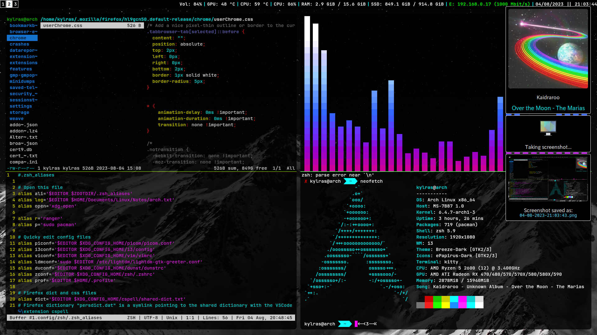

# dotfiles

My Arch Linux dotfiles

- This setup follows the XDG Base Directory Specification to achieve a clean $HOME
- Not too pretty, but pretty fast. Prioritizes frugality over eye candy. Minimalist aesthetic.
- POSIX-compliant scripts for media control, notifications, volume, brightness, and screenshots

