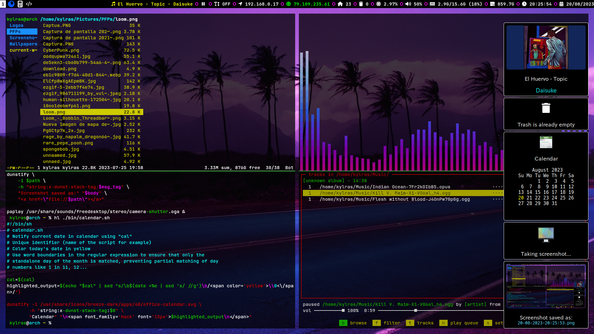

# dotfiles

My Linux dotfiles





- This setup follows the XDG Base Directory Specification to achieve a clean $HOME

- Prioritizes frugality over eye candy. Minimalist aesthetic. (aka, I have a
  potato PC and need to save as many CPU cycles as possible).

- POSIX-compliant scripts for media control, notifications, volume, brightness, and screenshots


- Leverages the natural ZSH dotfiles load order to achieve a minimum shell startup overhead:
  .zshenv -> .zprofile -> .zshrc -> .zlogin -> .zlogout

Only .zshrc is loaded every time for the aliases. Everything else goes to
.profile. Setting most of the configuration here makes them available to ttys aswell.

The Zsh login shell sources ~/.zprofile (hence the symlink to ~/.profile)

 #### XDG Base Directory Specification
 -----------------------
https://wiki.archlinux.org/title/XDG_Base_Directory

[User directories](https://wiki.archlinux.org/title/XDG_Base_Directory#User_directories) are defined in `etc/security/pam_env.conf` to make them available to the LightDM xsession wrapper script. 
This way we can manually config the display manager
to honor the default XDG dirs, forcing to check XDG_CONFIG_HOME.
```
export XDG_CONFIG_HOME="$HOME/.config"
export XDG_CACHE_HOME="$HOME/.cache"
export XDG_DATA_HOME="$HOME/.local/share"
export XDG_STATE_HOME="$HOME/.local/state"
```
